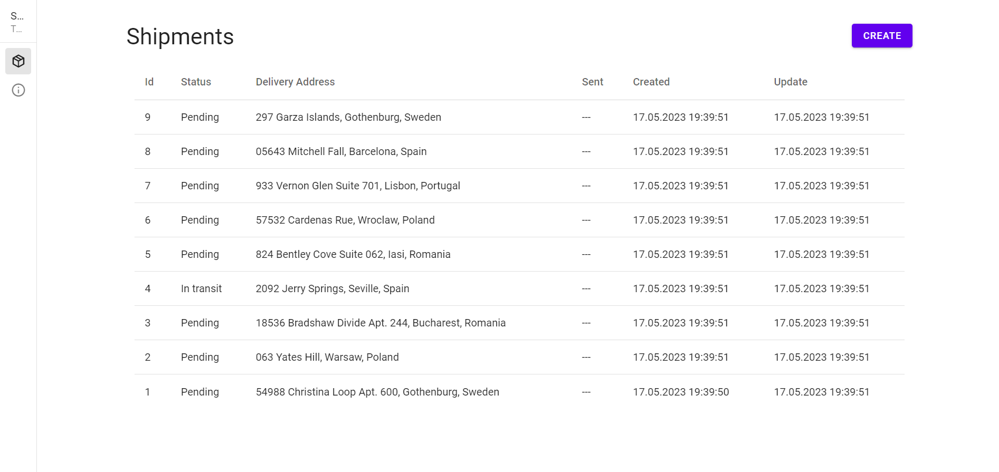
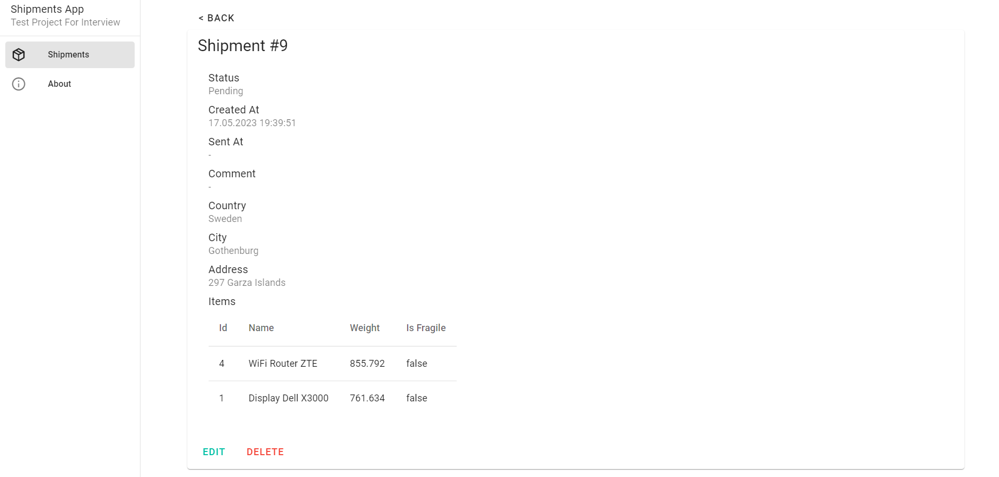

# ShipmentsTest

This a test project for a shipment management application. 

## Table of Contents
- [Prerequisites](#prerequisites)
- [Configuration](#configuration)
- [Running The Project](#running-the-project)
  - [Running Migrations](#running-migrations)
  - [Loading Demo Data](#loading-demo-data)
- [Project Structure](#project-structure)
  - [Backend](#backend)
  - [Frontend](#frontend)
- [Testing](#testing)
- [UI Screenshots](#ui-screenshots)
- [Acknowledgements](#acknowledgements)

## Prerequisites

- Docker
- Docker Compose

## Configuration

This project utilizes the following environment variables:

- `BACKEND_PORT`: Port number for the backend server. Default: `8000`.

- `FRONTEND_PORT`: Port number for the frontend server. Default: `8080`.

- `DJANGO_DEBUG`: Django Debug Mode. Default: `True`.

- `DJANGO_SECRET_KEY`: Secret key used by Django for cryptographic signing.

- `DJANGO_DATABASE_FILE`: File name of the SQLite database used by Django. Default: `db.sqlite3`.

- `DJANGO_CORS_ALLOWED_ORIGINS`: Allowed origins for Cross-Origin Resource Sharing (CORS) in Django.

- `VUE_APP_API_URL`: The URL for the backend API used by the Vue.js frontend.


## Running The Project

Execute following commands to start the application in Docker:

```bash
$ docker compose --env-file .env up -d
```

At a first run, you will need to apply Django migrations, refer to [Running Migrations](#running-migrations):\
Also you might want to load demo data, refer to [Loading Demo Data](#loading-demo-data).\
Access the application at http://localhost:8080.

### Running Migrations

Following scripts will run Django migrations in Docker:

Windows:
```bash
$ .\backend\scripts\migrate.bat
```

Linux:
```bash
$ chmod +x ./backend/scripts/migrate.sh && ./backend/scripts/migrate.sh
```

### Loading Demo Data

Following scripts will load demo data in Docker:

Windows:
```bash
$ .\backend\scripts\load_demo_data.bat
```

Linux:
```bash
$ chmod +x ./backend/scripts/load_demo_data.sh && ./backend/scripts/load_demo_data.sh
```

## Project Structure

### Backend

The backend API is built with Django and Django Rest Framework.
Database is configured to use SQLite3 for faster development.

**Main Dependencies:**
- Python==3.11
- Django==4.2.1
- djangorestframework==3.14.0

**Django Apps:**
- `catalog`: logic of items available for shipping.
- `shipments`: logic of shipments.

**Django Models:**
- `catalog.Item`: represents an item available for shipping.
- `shipments.Country`: represents a country.
- `shipments.City`: represents a city, belongs to a `Country`.
- `shipments.Shipment`: represents a shipment, can be related to multiple `Item` entities.

> In case of a real-world application, `Item` and `Shipment` would be bound together in a custom model many-to-many relationship with `count` field. This is not implemented due to time constraints.

**API Endpoints:**
- `/api/shipments/countries/`: read-only endpoint for `Country` entities.
- `/api/shipments/cities/`: read-only endpoint for `City` entities.
- `/api/shipments/shipments/`: CRUD endpoint for `Shipment` entities.

### Frontend

The frontend application is built with Vue.js, Vuex, and Vuetify.

**Main Dependencies:**
- Node.js 18.12.1
- Vue.js (^3.2.13)
- vuex: (^4.0.0)
- vuetify: (^3.0.0-beta.0)

**Views:**
- `ShipmentsView` ([ / ](http://localhost:8080/)): table of shipments.
- `ShipmentView` ([/shipments/:id](http://localhost:8080/shipments/1)) and ([/shipments/:id/edit](http://localhost:8080/shipments/1/edit)): shipment details, provides edit form and delete button.
- `ShipmentCreateView` ([/shipments/create](http://localhost:8080/shipments/create)): shipment creation form.
- `NotFoundView`: 404 error page.
- `AboutView` ([/about](http://localhost:8080/about)): quick project description.
> Items managing functionality is not implemented due to time constraints

## Testing

Testing covers `/api/shipments/shipments/` endpoint and checks correct work of create and update scenarios. Run backend tests:

```bash
$ docker-compose exec -it shipmentstest-backend python manage.py test
```

## UI Screenshots





## Acknowledgements
- Django: https://www.djangoproject.com/
- Django REST Framework: https://www.django-rest-framework.org/
- Vue.js: https://vuejs.org/
- Vuex: https://vuex.vuejs.org/
- Vuetify: https://vuetifyjs.com/
